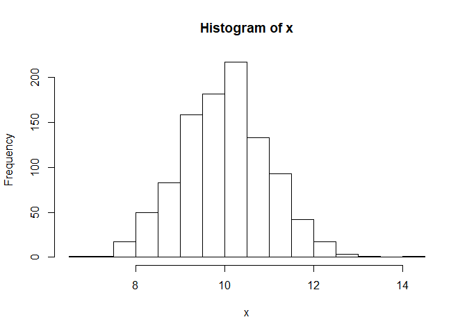
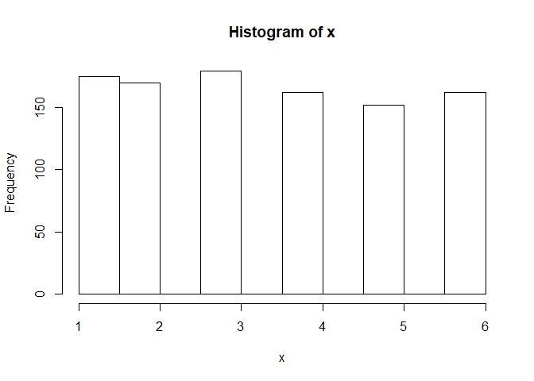
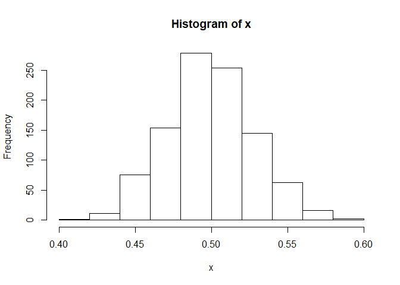
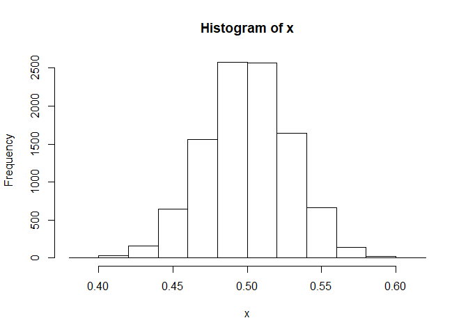
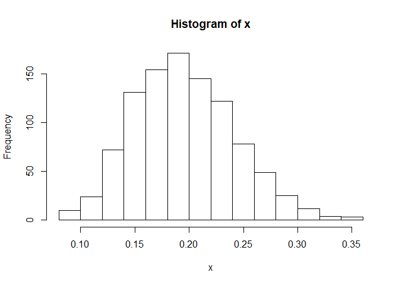
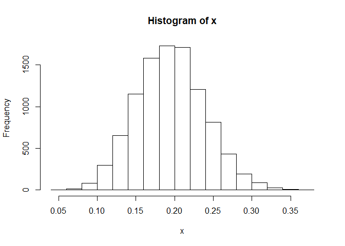
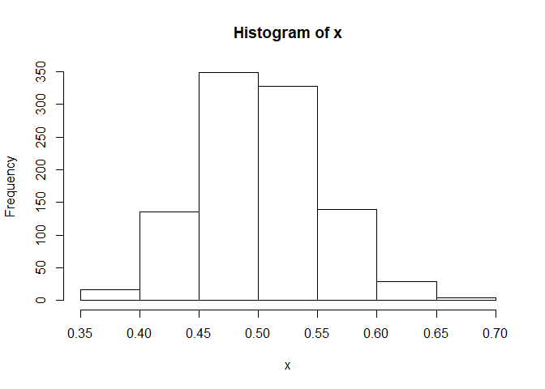
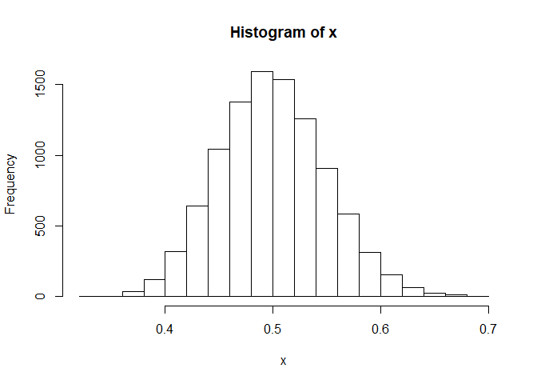

Assignment 1
================
Hyungue Lim
9/9/2019

# Part I

# 1

## S1

``` r
sum(1:2019)
```

    ## [1] 2039190

## S2

``` r
x <- 1:2019
sum(x^3)
```

    ## [1] 4.158296e+12

## S3

``` r
sum(x^x)
```

    ## [1] Inf

## S4

``` r
y <- c(1, -1)
z <- x*y
```

    ## Warning in x * y: longer object length is not a multiple of shorter object
    ## length

``` r
sum(z^x)
```

    ## [1] Inf

## S5

``` r
sum(1/(x^2))
```

    ## [1] 1.644439

## S6

``` r
sum(1/x)
```

    ## [1] 8.187821

## S7

``` r
sum(1/(x^3))
```

    ## [1] 1.202057

## S8

``` r
sum(1/z)
```

    ## [1] 0.6933948

# 2

## a

``` r
x <- rnorm(1000, 10,1)
mean(x)
```

    ## [1] 9.995126

``` r
sd(x)
```

    ## [1] 0.9852733

## b

``` r
'50% of the sample should be greater than 10'
```

    ## [1] "50% of the sample should be greater than 10"

``` r
sum(x>10)
```

    ## [1] 507

## c

``` r
hist(x)
```

<!-- -->

## d

``` r
x <- rnorm(1000, 2,1)
sum(x>1) / 1000
```

    ## [1] 0.849

# 3

## a

``` r
x <- sample(1:6, 1000, replace = TRUE)
```

## b

``` r
mean(x)
```

    ## [1] 3.432

``` r
sd(x)
```

    ## [1] 1.707129

## c

``` r
sum(x==6)
```

    ## [1] 162

## d

``` r
table(x, dnn = "Dice Frequency")
```

    ## Dice Frequency
    ##   1   2   3   4   5   6 
    ## 175 170 179 162 152 162

## e

``` r
prop.table(table(x, dnn = "Dice Relative Frequency"))
```

    ## Dice Relative Frequency
    ##     1     2     3     4     5     6 
    ## 0.175 0.170 0.179 0.162 0.152 0.162

## f

``` r
hist(x)
```

<!-- -->

# 4

## a

``` r
x_1 <- sample(1:6, 1000, replace = TRUE)
x_2 <- sample(1:6, 1000, replace = TRUE)
x_3 <- sample(1:6, 1000, replace = TRUE)

sum(x_1 > x_2 + x_3) / 1000
```

    ## [1] 0.093

## b

``` r
x_1 <- sample(1:6, 1000, replace = TRUE)
x_2 <- sample(1:6, 1000, replace = TRUE)
x_3 <- sample(1:6, 1000, replace = TRUE)

sum((x_1)^2 > (x_2)^2 + (x_3)^2) / 1000
```

    ## [1] 0.217

# 5

``` r
'tail = 0, head = 1'
```

    ## [1] "tail = 0, head = 1"

``` r
x_1 <- sample(0:1, 1000, replace = TRUE)
x_2 <- sample(0:1, 1000, replace = TRUE)
x_3 <- sample(0:1, 1000, replace = TRUE)

sum(x_1 == 0 & x_2 == 0 & x_3 == 0) / 1000
```

    ## [1] 0.119

# 6

``` r
'tail = 0, head = 1'
```

    ## [1] "tail = 0, head = 1"

``` r
count <- 0
for (i in 1:1000) {
  x <- 0
  x <- sample(0:1, 10, replace = TRUE)
    
    for (j in 1:8) {
      if (x[j] == 0 & x[j+1] == 0 & x[j+2] == 0) {
          count <- count +1
          break
      }
      }
      
    }
    
count
```

    ## [1] 525

# 7

## Normal Distribution

``` r
y <- matrix(runif(100000, min=0, max=1), nrow = 1000)

x <- rowMeans(y)

'X looks like normal distribution'
```

    ## [1] "X looks like normal distribution"

``` r
hist(x)
```

<!-- -->

``` r
#Increased Iteration

y <- matrix(runif(1000000, min=0, max=1), nrow = 10000)

x <- rowMeans(y)

'X looks like normal distribution'
```

    ## [1] "X looks like normal distribution"

``` r
hist(x)
```

<!-- -->

## Poisson Distribution

``` r
y <- matrix(rpois(100000, 0.2), nrow = 1000)

x <- rowMeans(y)

'X looks like normal distribution'
```

    ## [1] "X looks like normal distribution"

``` r
hist(x)
```

<!-- -->

``` r
#Increased Iteration
y <- matrix(rpois(1000000, 0.2), nrow = 10000)
x <- rowMeans(y)

'X looks like normal distribution'
```

    ## [1] "X looks like normal distribution"

``` r
hist(x)
```

<!-- -->

## Exponential Distribution

``` r
y <- matrix(rexp(100000, 2), nrow = 1000)
x <- rowMeans(y)


'X looks like normal distribution'
```

    ## [1] "X looks like normal distribution"

``` r
hist(x)
```

<!-- -->

``` r
#Increased Iteration
y <- matrix(rexp(1000000, 2), nrow = 10000)
x <- rowMeans(y)


'X looks like normal distribution'
```

    ## [1] "X looks like normal distribution"

``` r
hist(x)
```

<!-- -->

\#Part II

``` r
'# 7'
```

    ## [1] "# 7"

``` r
titanic <- read.csv("~/MATH 421/titanic.csv")
str(titanic)
```

    ## 'data.frame':    891 obs. of  12 variables:
    ##  $ PassengerId: int  1 2 3 4 5 6 7 8 9 10 ...
    ##  $ Survived   : int  0 1 1 1 0 0 0 0 1 1 ...
    ##  $ Pclass     : int  3 1 3 1 3 3 1 3 3 2 ...
    ##  $ Name       : Factor w/ 891 levels "Abbing, Mr. Anthony",..: 109 191 358 277 16 559 520 629 417 581 ...
    ##  $ Sex        : Factor w/ 2 levels "female","male": 2 1 1 1 2 2 2 2 1 1 ...
    ##  $ Age        : num  22 38 26 35 35 NA 54 2 27 14 ...
    ##  $ SibSp      : int  1 1 0 1 0 0 0 3 0 1 ...
    ##  $ Parch      : int  0 0 0 0 0 0 0 1 2 0 ...
    ##  $ Ticket     : Factor w/ 681 levels "110152","110413",..: 524 597 670 50 473 276 86 396 345 133 ...
    ##  $ Fare       : num  7.25 71.28 7.92 53.1 8.05 ...
    ##  $ Cabin      : Factor w/ 148 levels "","A10","A14",..: 1 83 1 57 1 1 131 1 1 1 ...
    ##  $ Embarked   : Factor w/ 4 levels "","C","Q","S": 4 2 4 4 4 3 4 4 4 2 ...

``` r
'# 8'
```

    ## [1] "# 8"

``` r
knitr::kable(titanic[1:10,])
```

| PassengerId | Survived | Pclass | Name                                                | Sex    | Age | SibSp | Parch | Ticket           |    Fare | Cabin | Embarked |
| ----------: | -------: | -----: | :-------------------------------------------------- | :----- | --: | ----: | ----: | :--------------- | ------: | :---- | :------- |
|           1 |        0 |      3 | Braund, Mr. Owen Harris                             | male   |  22 |     1 |     0 | A/5 21171        |  7.2500 |       | S        |
|           2 |        1 |      1 | Cumings, Mrs. John Bradley (Florence Briggs Thayer) | female |  38 |     1 |     0 | PC 17599         | 71.2833 | C85   | C        |
|           3 |        1 |      3 | Heikkinen, Miss. Laina                              | female |  26 |     0 |     0 | STON/O2. 3101282 |  7.9250 |       | S        |
|           4 |        1 |      1 | Futrelle, Mrs. Jacques Heath (Lily May Peel)        | female |  35 |     1 |     0 | 113803           | 53.1000 | C123  | S        |
|           5 |        0 |      3 | Allen, Mr. William Henry                            | male   |  35 |     0 |     0 | 373450           |  8.0500 |       | S        |
|           6 |        0 |      3 | Moran, Mr. James                                    | male   |  NA |     0 |     0 | 330877           |  8.4583 |       | Q        |
|           7 |        0 |      1 | McCarthy, Mr. Timothy J                             | male   |  54 |     0 |     0 | 17463            | 51.8625 | E46   | S        |
|           8 |        0 |      3 | Palsson, Master. Gosta Leonard                      | male   |   2 |     3 |     1 | 349909           | 21.0750 |       | S        |
|           9 |        1 |      3 | Johnson, Mrs. Oscar W (Elisabeth Vilhelmina Berg)   | female |  27 |     0 |     2 | 347742           | 11.1333 |       | S        |
|          10 |        1 |      2 | Nasser, Mrs. Nicholas (Adele Achem)                 | female |  14 |     1 |     0 | 237736           | 30.0708 |       | C        |

``` r
'# 9'
```

    ## [1] "# 9"

``` r
sum(is.na(titanic))
```

    ## [1] 177

``` r
sapply(titanic, function(x) sum(is.na(x)))
```

    ## PassengerId    Survived      Pclass        Name         Sex         Age 
    ##           0           0           0           0           0         177 
    ##       SibSp       Parch      Ticket        Fare       Cabin    Embarked 
    ##           0           0           0           0           0           0

``` r
'# 10'
```

    ## [1] "# 10"

``` r
Average_age <- mean(titanic$Age, na.rm = TRUE)

'# 11'
```

    ## [1] "# 11"

``` r
titanic$Age[is.na(titanic$Age)] <- Average_age

'# 12'
```

    ## [1] "# 12"

``` r
titanic_rm <- titanic[, c(-1,-4,-9,-11)]

'# 13'
```

    ## [1] "# 13"

``` r
mean(titanic_rm$Age[titanic_rm$Sex == "female"])
```

    ## [1] 28.21673

``` r
'# 14'
```

    ## [1] "# 14"

``` r
median(titanic_rm$Fare[titanic_rm$Pclass==1])
```

    ## [1] 60.2875

``` r
'# 15'
```

    ## [1] "# 15"

``` r
median(titanic_rm$Fare[titanic_rm$Sex == "female" & titanic_rm$Pclass !=1])
```

    ## [1] 14.45625

``` r
'#16'
```

    ## [1] "#16"

``` r
median(titanic_rm$Age[titanic_rm$Survived==1 & titanic_rm$Sex == "female" & titanic_rm$Pclass !=3])
```

    ## [1] 30

``` r
'# 17'
```

    ## [1] "# 17"

``` r
teens <- titanic_rm[titanic_rm$Age >= 10 & titanic_rm$Age <= 19,]
mean(titanic_rm$Fare[titanic_rm$Survived==1 & titanic_rm$Sex =='female'])
```

    ## [1] 51.93857

``` r
'# 18'
```

    ## [1] "# 18"

``` r
female_teens <- teens[teens$Sex == 'female',]
aggregate(female_teens$Fare, female_teens[c("Survived", "Pclass")], mean)[c(-3),]
```

    ##   Survived Pclass          x
    ## 1        1      1 107.540708
    ## 2        1      2  20.008850
    ## 4        1      3   8.769885

``` r
'# 19'
```

    ## [1] "# 19"

``` r
Average_fare <- mean(titanic$Fare)

Not_Survived_Paid_Lots <- sum(titanic$Survived == 0 & titanic$Fare > Average_fare)

Survived_Paid_Lots <-sum(titanic$Survived == 1 & titanic$Fare > Average_fare)

Survived_Paid_Lots / Not_Survived_Paid_Lots
```

    ## [1] 1.482353

``` r
'# 20'
```

    ## [1] "# 20"

``` r
titanic_rm$sfare <- (titanic_rm$Fare - Average_fare) /(sd(titanic_rm$Fare))

'# 21'
```

    ## [1] "# 21"

``` r
cheap_or_not <- function(x) {
  if (x < Average_fare) {
   y <- "cheap"
  }
  if (x > Average_fare) {
    y <- "expensive"
  }
  if (x == Average_fare) {
    y <- "normal"
  }
  y
}
cheap_or_not(10)
```

    ## [1] "cheap"

``` r
titanic_rm$cfare <- sapply(titanic_rm$Fare, cheap_or_not)

'# 22'
```

    ## [1] "# 22"

``` r
titanic_rm$cage <- sapply(titanic_rm$Age, function(x) x/10 - (x%%10)/10)

'# 23'
```

    ## [1] "# 23"

``` r
table(titanic_rm$Embarked)
```

    ## 
    ##       C   Q   S 
    ##   2 168  77 644

``` r
levels(titanic_rm$Embarked)[1] <- "S"
```
